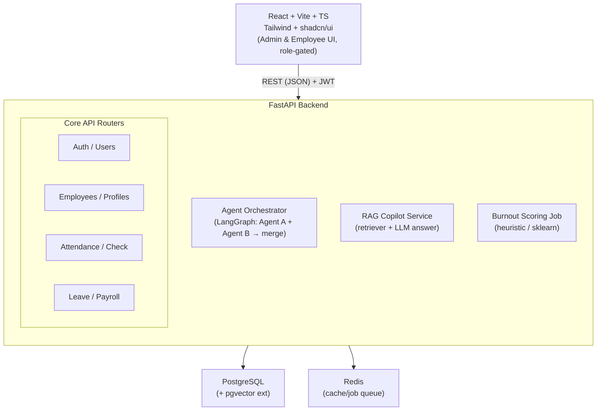

# Dayflow

**Every workday, perfectly aligned.**

Dayflow is a next-generation Human Resource Management System (HRMS) designed to eliminate manual administration through intelligent automation. It supercharges core HR operations with an agentic leave triage pipeline, a RAG-powered HR policy copilot, and predictive burnout analytics. Built for modern teams, Dayflow seamlessly surfaces proactive insights to admins while providing a frictionless self-service experience for employees.


## Table of Contents

- [Overview](#overview)
- [Features](#features)
  - [AI-Powered Differentiators](#ai-powered-differentiators)
  - [Core HRMS Features](#core-hrms-features)
- [Tech Stack](#tech-stack)
- [Architecture](#architecture)
- [Getting Started](#getting-started)
- [Project Structure](#project-structure)
- [Team](#team)
- [Roadmap / Future Enhancements](#roadmap--future-enhancements)
- [License](#license)

## Overview

Manual HR administration is slow and reactive. Admins manually cross-check leave requests against project deadlines and team availability, employees struggle to find fast answers to policy questions, and employee burnout is often invisible until someone resigns. 

Dayflow solves this by digitizing baseline HR operations—attendance, leave, payroll, and onboarding—and layering intelligent workflows on top. By using the attendance and leave data the system already collects, Dayflow proactively flags burnout risks, instantly answers policy questions, and pre-evaluates every time-off request before a human ever reviews it. 

## Features

### 🚀 AI-Powered Differentiators

**Agentic Leave Approval Triage**
Every time-off request is run through a multi-agent evaluation pipeline before it reaches the Admin queue, providing a pre-analyzed recommendation instead of a blank request.
- **Compliance Agent:** Checks for overlapping leave within the team, proximity to flagged project deadlines, and available leave balance.
- **Pattern Recognition Agent:** Identifies unusual trends, like recurring Friday absences or frequent uncertified sick leave.
- **Orchestrator:** Combines verdicts into a human-readable recommendation (Approve, Review, or Reject) with confidence labeling, surfacing it directly in the Admin's approval dashboard.

**RAG-Powered HR Policy Copilot**
A chat assistant available to employees that answers natural-language questions by grounding responses in company policy documents and the employee’s live data.
- Ingests policy docs, holiday calendars, and payroll FAQs into a vector store.
- Securely retrieves row-level employee data (e.g., specific leave balances) at query time.
- Blends live balance numbers with retrieved rules, keeping strict row-level authorization to prevent data leakage.

**Predictive Burnout Analytics**
A dynamic risk-scoring model that evaluates attendance and leave patterns to surface an early warning "Burnout Risk" alert for Admins and HR.
- Tracks average check-out time trends, work-hour variance, weekend check-ins, and days since last approved leave.
- Assigns a 0–100 risk score and visually highlights at-risk employees in the dashboard with a breakdown of contributing factors.

### 💼 Core HRMS Features

- **Authentication & Roles:** Secure JWT-based sessions, auto-generated login IDs, and distinct interfaces for Admin/HR and Employees.
- **Dashboard:** Employee grid with real-time status dots (present, absent, on leave) and a one-click check-in/check-out system.
- **Profile Management:** Centralized hub for private employee info, certs, and skills, alongside Admin-only access to automated salary component computations.
- **Attendance Management:** Automated work and extra hour calculations with granular daily views for employees and aggregated views for Admins.
- **Leave Management:** Calendar-based PTO and sick leave requests with balance tracking, attachments, and structured Admin approval queues.
- **Payroll Visibility:** Read-only salary breakdown for employees and automated recalculations for dependent components whenever base wages change.

## Tech Stack

| Layer | Choice | Why |
|---|---|---|
| **Frontend** | React + Vite + TypeScript + Tailwind CSS + shadcn/ui | Fast HMR, strict typing for user-class data shapes, matches wireframes cleanly, and provides ready-made accessible components. |
| **Backend** | Python + FastAPI | Unifies AI features and the API/DB layer in one process, avoiding extra network hops and runtimes. |
| **Database** | PostgreSQL | Handles relational HR data natively while doubling as a vector store via `pgvector`. |
| **Cache/Queue** | Redis | Session management, rate-limiting, and background job queuing. |
| **Vector Store** | `pgvector` (PostgreSQL Extension) | Eliminates the need for a separate vector DB service, perfect for hackathon scale. |
| **Agent Orchestration** | LangGraph | Explicit, debuggable graph orchestration for merging Agent A and Agent B outputs. |
| **LLM Provider** | Anthropic Claude API (or OpenAI) | Generates RAG copilot answers and synthesizes human-readable agent recommendations. |
| **Burnout Scoring** | Heuristic scorer + scikit-learn | Reliable weighted baseline for demoing, with an optional logistic regression layer for AutoML capabilities. |
| **Auth** | JWT + passlib/bcrypt | Standard, reliable, no extra infrastructure required. |
| **Containerization** | Docker + Docker Compose | Ensures a single `docker compose up` identically spins up the full stack across Windows, Mac, and Linux. |

## Architecture



## Getting Started

1. Clone the repository and navigate into the directory:
   ```bash
   git clone <repo>
   cd dayflow
   ```
2. Set up the environment variables (fill in your API keys in the `.env` file):
   ```bash
   cp .env.example .env
   ```
3. Boot the stack using Docker Compose:
   ```bash
   docker compose up --build
   ```
4. Access the application:
   - Frontend: `http://localhost:5173`
   - API / Swagger UI: `http://localhost:8000/docs`

> **Note:** For Windows users, it is highly recommended to run Docker Desktop with the **WSL2 backend** (not Hyper-V) and clone the repository *inside* the WSL filesystem (e.g., `~/dayflow`). Bind-mount performance and file-watching (HMR) are dramatically better from the Linux filesystem than from a Windows path mounted into WSL.

## Project Structure

```text
dayflow/
├── docker-compose.yml
├── .env.example
├── frontend/
│   ├── Dockerfile
│   ├── Dockerfile.dev
│   ├── package.json
│   └── src/
├── backend/
│   ├── Dockerfile
│   ├── pyproject.toml
│   ├── app/
│   │   ├── main.py
│   │   ├── core/          # config, security, deps
│   │   ├── models/        # SQLAlchemy models
│   │   ├── schemas/       # Pydantic schemas
│   │   ├── api/           # routers: auth, employees, attendance, leave, payroll, copilot, agents
│   │   ├── agents/        # LangGraph agent definitions
│   │   ├── rag/           # ingestion + retrieval
│   │   └── ml/            # burnout scoring
│   └── seed/
│       ├── seed_data.py
│       └── policy_docs/   # markdown policy files for RAG ingestion
└── docs/
    ├── Dayflow_PRD.md
    └── Dayflow_Technical_Project_Doc.md
```

## Team

| Role | Focus Area |
|---|---|
| **Frontend Lead** | Vite/React app scaffold, routing, Tailwind/shadcn setup, Admin dashboard + Employee dashboard, attendance & leave UI, integrating the copilot chat widget |
| **Backend/API Lead** | FastAPI project structure, Auth, Employees, Attendance, Leave, Payroll CRUD endpoints, DB schema/migrations, Docker Compose plumbing |
| **AI/Agents Lead** | Agent A + Agent B, LangGraph orchestration, recommendation merge logic, LLM client wrapper |
| **AI/RAG + Analytics Lead** | Policy doc ingestion, embedding pipeline, `pgvector` retrieval, copilot endpoint, burnout heuristic + optional sklearn model |

## Roadmap / Future Enhancements

- **Comprehensive Analytics:** Full analytics and reports dashboard including exportable PDFs for salary slips and attendance reports.
- **Notification System:** Email and push notifications for leave approvals, reminders, and proactive burnout alerts.
- **Configurable Compliance:** Department-level configurations and rule-setting for the Compliance Agent.
- **Advanced Burnout Modeling:** Continuously retrained ML burnout model fed by real company usage data.
- **Multi-Tenant Support:** Extending the architecture to support multiple companies natively on the same instance.

## License

MIT — see LICENSE